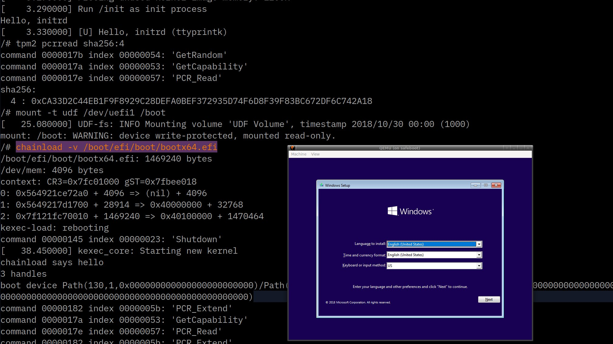

# Linux-as-an-EFI-Bootloader



This tree allows Linux to run as an EFI boot loader application
and to hand control back to the UEFI firmware so that it can chainload
into another EFI executable, such as the Windows boot loader.
It doesn't touch any devices or UEFI memory, so the firmware state
is retained upon resuming the UEFI context.


## uefidev

This module provides Linux device driver wrappers for several of the
UEFI vendor firmwre provided interfaces.  Normally this is not possible
since Linux calls `gBS->ExitBootServices()`, which tears down most
of the UEFI device drivers, and because Linux does not have a memory
mapping for the UEFI linear memory.

This module depends on a specially modified loader for the
kernel that makes the *first* call to `ExitBootServices()` into a NOP,
and then returns succes.  The loader also allocates memory for the
kernel at 1 GB and passes this to the kernel with the `memmap=exactmap`
command line option option to ensure that the Linux kernel doesn't
accidentally modify any of the UEFI data structures.

The technique of writing directly to CR3 is a total expedient hack
and definitely not a production ready sort of way to restore the
memory map.


### Block Devices

This submodule provides an interface to the vendor firmware's registered
`EFI_BLOCK_IO_PROTOCOL` handlers, which allows Linux to use them
as if they were normal block devices.  UEFI tends to create a block
device for the entire disk and then separate ones for each partitions.
You can also have Linux detect the partitions by using `losetup` on
the whole disk device:

```
losetup -f -P /dev/uefi0
mount /dev/loop0p2 /boot
```

Or something like this, although your device numbers might be different:

```
mount -o ro /dev/uefi6 /boot
```

You can retrieve the UEFI DevicePath or handle from

```
cat /sys/devices/virtual/block/uefi6/uefi_devicepath
cat /sys/devices/virtual/block/uefi6/uefi_handle
```


Todo:

* [ ] Benchmark the performance
* [X] Test with the ramdisk module
* [X] Support CDROM devices with their big block sizes

## Ramdisk

The Linux boot loader can pass data to the next stage via a UEFI
ramdisk, which can be created by echo'ing the disk image file name into
`/sys/firmware/efi/ramdisk`.

### Loader

New UEFI modules can be loaded by echo'ing the file name into
`/sys/firmware/efi/loader`.  This should measure them into
the TPM and eventlog.  It can also be used to chain load
the next stage, although this won't turn off the Linux interrupts
and can cause problems.  Use the `chainload` tool instead.

### Network Interfaces

This submodule create an ethernet interface for each of the
vendor firmware's registered `EFI_SIMPLE_NETWORK_PROTOCOL` devices.
The Linux `skb` transmit functions put packets directly on the wire,
and there is a periodic timer that polls at 100 Hz for up to ten packets.
It's not going to be a fast interface, but it will hopefully be enough
to perform attestations or other boot time activities.

Todo:

* [ ] Make polling timer a parameter
* [ ] Interface with the UEFI event system?


### TPM Devices

Because ACPI and PCI are disabled, the TPM is not currently visible
to Linux via the normal channels.  Instead this submodule will
query the `EFI_TCG2_PROTOCOL` objects and create TPM character
devices for each of them.  While the UEFI object has methods for
high-level things like "Extend a PCR and create an event log entry",
this module uses the `SubmitCommand` method to send the raw commands
that the Linux driver generates.  It buffers the response and returns
it immediately; there is no overlapping of commands or multi-threading
allowed.

Todo:

* [X] Figure out how to expose the TPM.
* [X] Figure out how to export the TPM event log
* [ ] Change the event log to be "live" rather than a copy

## Chainload

The `chainload` program has a small purgatory to resume the
UEFI context that the `loader.efi` has stored at 0x100 in physical
memory.  It also assumes that the next image to be run is in
virtual memory at `0x40100000` and calls `gBS->LoadImage()` and
then `gBS->StartImage()` on it to transfer control to the
new kernel.

Typical usage is:

```
mount -o ro /dev/uefi6 /boot
chainload -v --boot-device uefi6 /boot/EFI/Boot/bootx64.efi
```


* [X] Device path for the loaded image is passed in

## Building

The `Makefile` will download and patch a 5.4.117 kernel with the
to add the `uefidev` kernel module as an in-tree build option.
It will then apply a minimal config that has no PCI drivers and
uses the EFI framebuffer for video.

```
make -j$(nproc)
```

This will produce after a while `bootx64.efi` that contains the
kernel and a minimal initrd, unified with the `loader.efi` program
using the same `objcopy` technique as the systemd EFI stub.
You can sign it with `sbsigntool` for SecureBoot systems or
boot it without signing on qemu.


Creating the local machine state (not including the TPM):
```
qemu-img create win10.hda 12G
```

### Running in QEMU

Launching the emulator is messy due to the need to pass in the separate
UEFI nvram (the one in `config/OVMF_VARS.fd` has been modified so that
the UEFI boot order starts with PXE; otherwise the virtual machine will
always boot via the hard disk since OVMF ignores the `-boot n` option
to request a network boot).

You can run `make qemu` or:

```
qemu-system-x86_64 \
  -M q35,accel=kvm \
  -m 2G \
  -drive if=pflash,format=raw,readonly,file=/usr/share/OVMF/OVMF_CODE.fd \
  -drive if=pflash,format=raw,file=config/OVMF_VARS.fd \
  -netdev user,id=eth0,tftp=.,bootfile=build/bootx64.efi \
  -device e1000,netdev=eth0 \
  -serial stdio \
  -cdrom win10.iso \
  -hda win10.img
```

### TPM emulation

To emulate a TPM 2.0, install or build the `swtpm` package and 
run with `make TPM=1 qemu`.  The TPM's EK will be in `build/tpm-state/ek.pem`
for attestation verification.

Tested with:

* [swtpm 0.7.1](https://github.com/stefanberger/swtpm/releases/tag/v0.7.1)
* [libtpms 0.9.1](https://github.com/stefanberger/libtpms/releases/tag/v0.9.1)
* [tpm2-tss 3.2.0](https://github.com/tpm2-software/tpm2-tss/releases/tag/3.2.0)
* [tpm2-tools 5.2](https://github.com/tpm2-software/tpm2-tools/releases/tag/5.2)

### Debugging

For more convenient debugging, you can turn off the graphical QEMU window:
`make NOGRAPHIC=1 qemu`

### Todo

* [X] Wrap kernel building in the `Makefile`
* [X] `initrd.cpio` building
* [X] Unified image building with the loader
* [ ] LinuxKit or buildroot integration?

### Kernel command line

```
memmap=exactmap,32K@0G,512M@1G noefi acpi=off
```

* [ ] Make the loader built this addition to the command line
* [ ] Allocate the SMP trampoline correclty in UEFI
